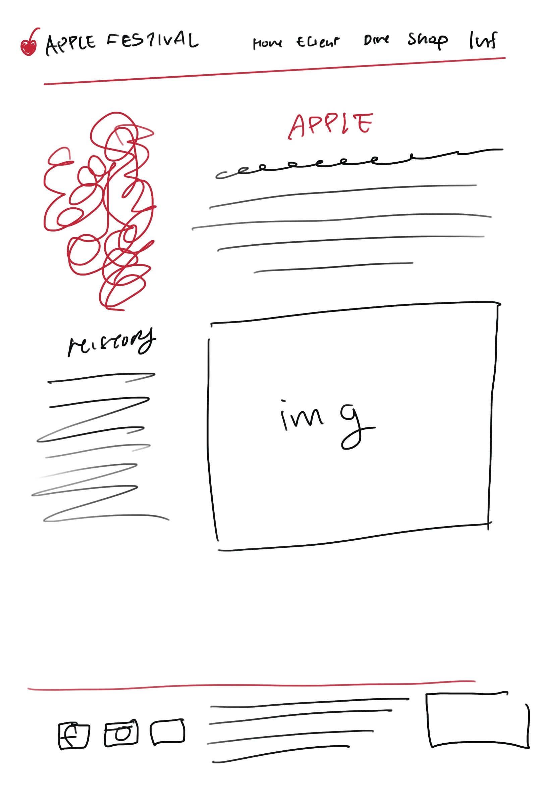

# Project 1: Design Journey

**For each milestone, complete only the sections that are labeled with that milestone.** Refine all sections before the final submission.

You are graded on your design process. If you later need to update your plan, **do not delete the original plan, leave it in place and append your new plan _below_ the original.** Then explain why you are changing your plan. Any time you update your plan, you're documenting your design process!

**Replace ALL _TODOs_ with your work.** (There should be no TODOs in the final submission.)

Be clear and concise in your writing. Bullets points are encouraged.

**Everything, including images, must be visible in _Markdown: Open Preview_.** If it's not visible in the Markdown preview, then we can't grade it. We also can't give you partial credit either. **Please make sure your design journey should is easy to read for the grader;** in Markdown preview the question _and_ answer should have a blank line between them.

## Markdown Instructions

## Existing Design (Milestone 1)

**Make the case for your decisions using concepts from class, as well as other design principles, theories, examples, and cases from outside of class (includes the design prerequisite for this course).**

You can use bullet points and lists, or full paragraphs, or a combo, whichever is appropriate. The writing should be solid draft quality.

### Existing Site: The Site (Milestone 1)
> What is your existing site about? Tell us about it.

My existing website was from project 3 from INFO 1300. It was a website that gave general information about the apple festival. It has 5 pages: the home, events, shop, dine, and info pages. It is both responsive and has javascript on it. It has the accordion in the FAQ page and a carousel on the dine page. I included a large variety of images for the users and information on when the festival started. The targeted audience for my website was students and Ithacian locals.

> How and where did you create this site?

I created this website using HTML, CSS, and Javascript. The first thing I did when creating this website was think of a design for the website. Then I created the HTML, followed by the CSS, lastly I added the javascript. I created this website while I was in my last semster INFO 1300 course.

> Is this site designed for desktop, mobile devices or both?

It is designed for desktop.

> Explain with this website is a **static** website.

This website is a static website because nothing changes in the website. The audience is recieving the same content. Additionally there aren't any addition functions like filtering, login/signup, and a search button.

### Existing Site: Audience (Milestone 1)
> Briefly explain your site's audience.
> Be specific and justify why this audience is a **cohesive** group.

The audience of this website is students and Ithacan locals. This is a cohesive group because they both share common goals and levels of information. They have come to the apple festival website to learn more details about the Apple Festival. This includes details like where it will be held, how it will be held, when it will be held, transportation, events, and other minor details.

### Existing Site: Audience Goals (Milestone 1)
> Document your existing site's audience's goals. (These should be informed by user research. Not assumptions or stereotypes.)
> List each goal below. There is no specific number of goals required for this, but you need enough to do the job (Hint: It's more than 1 and probably more than 2).

Goal 1: FIND WHAT THEY ARE LOOKING FOR EASILY:Form to find what the audience may want from the website

- **Design Ideas and Choices** _How will you meet those goals in your design?_
- I want to make a form to gauge what the audience may want in the Apple Festival. This could be useful for next year and following apple festivals
- **Rationale & Additional Notes** _Justify your decisions; additional notes._
  - I think this will be useful for the coordinators of the Apple Festival. The information will be useful for following Apple Festivals in the future.

Goal 2: FASTER SEARCHING: Filtering

- **Design Ideas and Choices** _How will you meet those goals in your design?_
  - I think in the events and dine page there should be a filter for what type of events or what type of food. It will be in an obvious place on the website so they know where to click it. It will make it easier and faster for the audience to get the information they are looking for
  -
- **Rationale & Additional Notes** _Justify your decisions; additional notes._
  - My rationale for this is that it will make it more accessible and convenient for users. Since users spend "10 seconds" to search what they're looking for when opening a website, this will be useful to shorten the time they need to spend.

Goal 3: CONVIENENT SEARCH: Something to tell you the time or your location from the apple festival

- I will meet my goals with this by making it easier for my audience to find information. Users are likely to see an image before they read any text. I think it would be useful if there was a map that showed you how far you are from the apple festival. I think this idea is similiar to what fedex does or an website that shows a map. Other then this, having a time will be useful for the audience. This will help the users feel more comfortable by making the clock accessible.

### Existing Site: Design/Sketches (Milestone 1)
> Sketch your existing site. Include these sketches here.
> **You may not copy your sketches from a previous assignment.**
> Why can't you copy the sketches? I want to get you thinking about the strengths/weaknesses of the current design.
> Provide an explanation _underneath_ each sketch explaining the sketch and any design patterns you are leveraging.

I was thinking of adding some sort of form to gather user research for next year. I think this would be a good idea to better the website for another time. It lets the coordinator get a good idea about what their audience wants. I wanted to put it on the homepage, however, I didn't want to discrupt the current look of the homepage so I wanted to put it at the bottom with the contact information.

For my second idea, I saw on our course website we would be learnign how to filter. So it thought that would be a good idea for a dine page if the audience wanted to search for a certain website. Typically the filter is at the top of the page so I wanted to remove the carousel and focus the page around the filter. I also wanted to reorganize the resturants I put there into squares so that it would appear as buttons on the screen.

Lastly, I wanted to have a map on the info page. This would help the audience grasp how far the apple festival is and what there is to do at the apple festival.

## Milestone 1 Feedback Revisions (Milestone 2)
> Explain what you revised in response to the Milestone 1 feedback

I decided that for my earliest design I wanted to implement a filter system and a map feature. I think these ideas would be too hard to manage so I wanted to opt for just the form for the sake of time. I think what I want to do instead is make it so when I switch to a specific page it the title in the navigation bar is highlighted. I also want to focus on making sure I have all my snippets and partials figured out. This will make my website more clean and increase efficiency if I ever want to change my header/navigation.

## Refined Design (Milestone 2)

### Refined Design: Persona (Milestone 2)
> Use the goals you identified above from your prior user research to develop a persona of your site's audience.
> Your persona must have a name and a face. The face can be a photo of a face or a drawing, etc.
> You may type out the persona below with bullet points or include an image of the persona. Just make sure it's easy to read the persona when previewing markdown.

Persona's Name: Bobby Bob

- He is a student that lives in Ithaca. He has never experienced the Apple Festival before and is looking for information

Factors of Influence

- Doesn't have a car (Transportation)
- work schedule
- Income and cost

Needs/Obstacles

- Needs to know how to commute to the festival
- Needs to know what is going on at the festival
- Events that will be at the festival
- Dining/food information needed

### Refined Design: Mobile or Desktop (Milestone 2)
> Will your refined design be functional on mobile, tablet, or desktop devices?

Desktop

### Refined Design: Form Brainstorm (Milestone 2)
> Brainstorm ideas for collecting data from your persona on your website.
> The form must support the persona's goals when using the website.
> For each form idea, explain how the form supports the goals of the persona.
> **Refer to the persona by name.**

- Form on what events should be at the Apple Festival
  - Events that should reappear or ideas for the next Apple Festival
- Form for vendors that should be invited
  - Maybe there is a food that is desired by the audience. Good way for the audience to give input to the collaborators

This would be good for Bobby because he will get a chance to see what is happening at the festival. The form allows him to include his input in what events should be in the Apple Festival. Additionally, a food on the food that should be in the festival allows Bobby to get an inside look on what the festival is going to be like.

### Refined Design: Content (Milestone 2)
> List **all** the content you plan to include your website for your **persona**.
> You should list all types of content you planned to include (i.e. text, photos, images, etc.)
> List the content here. Label the content as "(new)" if it's new to the existing site.

- Part of website that details form of transportation
- Part of website that details food that is liked by locals/students
- List of events that are happening at the festival
- images of food, events, and mapping of festival

### Refined Design: Content Justification (Milestone 2)
> Explain why this content supports the goals of your persona.
> **Refer to the persona by name.**

Having this content supports the goals of Bobby by making it easy and quick to access information. This information is crucial since he is a student that doesn't know much about the festival. The majority of students don't have cars so they would be relying on buses to get to the Apple Festival. Additionally, for some students, they may not know the most about the Apple Festival so having this information is useful.

### Refined Design: Content Organization (Milestone 2)
> Organize the content for the audience and identify possible pages for the content using **multiple iterations** of card sorting.
> Include photographic evidence of each iteration of card sorting **and** a explanation of your thought process for each iteration.
> **Please physically sort cards;** please don't try and do this digitally.
> **Refer to the persona by name.**

I put all the general information in 1. I thought that everything that had to go with entertainment had to go together; things like events, attractions, music, etc. I also thought that everything that had to do with food would go togehter, like venders, food, and restuarants. Things like souvenirs, shops, etc were also grouped together. Lastly, other information that didn't match with the other groups went in number 5.

This iteration wasn't super different from the first cardsort however I did change some sorts between number 1 and 5. I thought some general information may make more sense next to the date and time of the festival. I wasn't sure where to include the history of the Apple Festival. I thought it may align well with next to the FAQ.

### Refined Design: Navigation (Milestone 2)
> Please list the pages you will include in your website's navigation.

- Home
- Dine
- Shop
- Events
- Info

> Explain why the names of these pages make sense for your persona.

These names are clear and concise. They are also commonly used for the majority of sites.

### Refined Design: Design (Milestone 2)
> Refine the design of your site to address the goals of your persona.
> Include iterations of **sketches** for each page of the refined design.
> Provide a brief explanation _underneath_ each sketch.
> Document your _entire_ design process. **Show your preliminary sketches and your final sketches.** **We want to see iteration!**
> **Refer to your persona by name in each explanation.**

I wanted to highlight the name of the page in the navigation. I also decided I want to add a footer and a subscription to the bottom within the footer. Information will be useful to Bobby since it is organized neatly and in a way that matches the majority of websites

Highlight events in the navigation. Make mailing list in the footer. Bobby can find content on the events and music that is happening at the festival

Similar to the old design but with Dine highlighted. Footer has forms. Bobby who doesn't know the area can find out what is being vended at the Apple Fesitval.

Shop is highlighted in red. Footer has forms. Bobby can find information on shop and stores here.

Page is similar design with footer and more responsive navigation to indicate what page you are on. Bobby can find commuting information on this page

This is the form sketch, it will be located in the info page under the parking information.

This is the confimation page once you submit the form. It will list out your answers and say thank you. It will tell you to refresh to get back to old page.

This is the error page. If you write the wrong information for the forms, it will lead you here. It will say 404 error at the top and have a small paragraph below telling you what you did wrong and how to go back.

### Partial Plan (Milestone 2)
> Using your refined sketches, plan your site's partials.
> You may describe each partial or sketch it. It's up to you!
> Explain how you will customize at least 1 partial.

I want to make a partial for the header of each page. I want to include the apple logo and the navigation together on each page. I have also considered making a footer to the website, so I may consider making that a partial as well. I will customize the partial according to the title of each page using PHP.

## Milestone 2 Feedback Revisions (Milestone 3)
> Explain what you revised in response to the Milestone 2 feedback

I went back and gave my persona a drawing and I added sketches for the confirmation page and 404 error page.

## Form Design and Planning (Milestone 3)

### Refined Form Design (Milestone 3)
> Refine the design of your site's form to address the goals of your persona.
> Include iterations of **sketches** of the form and its confirmation message.
> Provide a brief explanation _underneath_ each sketch.
> **Refer to the persona by name.**

This is the finalized design of the form. I decided I wanted to make the form a survey of what the clients may want to see for next years Apple Festival. This will be helpful to Bobby and the host of the Apple Festival by allowing him to give his input on the Apple Festival. I wanted to get his name, email, likes on applefest, dislikes on apple fest, his overall rating of apple festival, and if he wanted to join the mailing list. I wanted to follow the guidelines to make this easy to read for the user. So I put everything to the right or bottom of the question. I also made sure to put the submit button at the right bottom.

I adjusted the alignment of the review submission. I wanted the words to be at the center of the screen so it captures the attention of the audience. I thought about clearing everything else in the page and just having the confirmation.

I wanted to make the message more clear so I thought about adding an image. It would be a "sad apple", this would match the theme of the website while also adding a cute and cartoony aspect to the site.

### Form Planning (Milestone 3)
> Will your form use a GET or POST request.
> Justify your decision as to why the request type is appropriate for the form.

I will use a POST request because I will be asking for the clients name and email. This information will need to be private and shouldn't be accessed by a lot of people. A GET request would be better for less private and general information. We wouldn't want our users information to get out.

## Milestone 3 Feedback Revisions (Final Submission)
> Explain what you revised in response to the Milestone 3 feedback
I have decided to redraw the Apple Festival Form design. I wanted to alter the alignment of the questions so it is easier to read for the user.

## Complete & Polished Website (Final Submission)

### Routing (Final Submission)
> Plan your HTTP routing.
> List each route and the PHP file for each route.

| Route                   | PHP File                            |
| -----------             | ----------------------------------- |
| /                       | pages/home.php                    |
| /events                 | pages/events.php                   |
|  /dine                  | pages/dine.php                      |
|  /shop                  | pages/shop.php                      |
|  /info                  | pages/info.php                      |
|  /info/confirmation     | pages/info-confirmation.php        |

> Explain why these routes (URLs) are usable for your persona.

 These routes are compresive and simple. It is easy to understand, so the user won't need to put too much care into reading everything. Additionally, it also fits in line with the majority of HTTP Routing URLS since its so simple.

### Refined Missing Resource Page (Milestone 3)
> Refine the design of your site's missing resource 404 page for your persona.
> Include iterations of **sketches** of the page.
> Provide a brief explanation _underneath_ each sketch.
> **Refer to the persona by name.**

I decided I wanted to put the error header under the apple instead of on top of it. I thought putting it on top would make a readibility issue. I also wanted to change the text under it to something more concise. I wanted to make it more friendly and desciptive on what the issue is. Something like "Oops, seems like this page doesn't exist. Please check your URL to see if it's typed correctly. Thank you!". I think this would be easy to understand for bob. It also creates an friendly atmosphere.

### Accessibility Audit (Final Submission)
> Tell us what issues you discovered during your accessibility audit.
> What do you do to improve the accessibility of your site?

I realized that some of my pages didn't have a default language. I went through all my files and made the language english. I also had some issues with citations for my imgs for social media. It said I needed text for my citations so I added text. Additionally, I also fixed my contrast errors by changing the color of some of my text and background colors.

### Final Design + Audience Goals (Final Submission)
> Tell us how your final site addresses the goals of the audience.
> Be specific. Tell us how you tailored your design, content, etc. to make your website usable for your persona.
> **Refer to the persona by name.**

I think my final website addresses the goals of my audience by making the website more clean and functional. Previously I didn't show the title of the page in the header, but now with the partial, I can do that easily. This will help Bobby by letting him easily know what page he is on. Additionally, previously we didn't have an error page. Now that we have one, it will make it clearer to Bobby when something is wrong. Furthermore, we also created a footer partial which didn't exist before. Footers are in line with most websites on the web. Having a footer allows Bobby to not have to scroll all the way to the top of the page again. Lastly and most importantly, we created a form which will enhance the user experience. This will allow Bobby to give his input to the host of the Apple Festival. While he is doing this form, he is also able to learn more about the Apple Festival as he views the website. I tailored my design to be friendly and simple. This why any user(like bobby) would be able to navigate through the pages easily. Also, the design of the website is apple themed which would be more appealing and friendly towards an user like Bobby.

### Self-Reflection (Final Submission)
> Take some time here to reflect on how much you've learned since you started this class. It's often easy to ignore our own progress. Take a moment and think about your accomplishments in this class. Hopefully you'll recognize that you've accomplished a lot and that you should be very proud of those accomplishments!

 I think I have learned a lot through completing this project. I learned how to make my pages dynamic and how to make a form through html. I think these skills are very useful in the future whenever I'd need to make a website.

## Grading (Final Submission)

### Grading: Mobile or Desktop (Final Submission)
> When we grade your final site, should we grade this with a mobile screen size or a desktop screen size?

Desktop

### Grading: Partials (Final Submission)
> Clearly list each partial file and where you used it.
- Header partial: Every page at the top of page.
- Footer Partial: Every page at the bottom of page.

> Which partials have customization? Explain how the customization looks in the browser.

- header.php: shows the title of the page. Navigation bar also glows red and is bolded.

### Collaborators
> List any persons you collaborated with on this project.

none.

### Reference Resources
> Please cite any external resources you referenced in the creation of your project.
> (i.e. W3Schools, StackOverflow, Mozilla, etc.)

W3School, Mozilla
